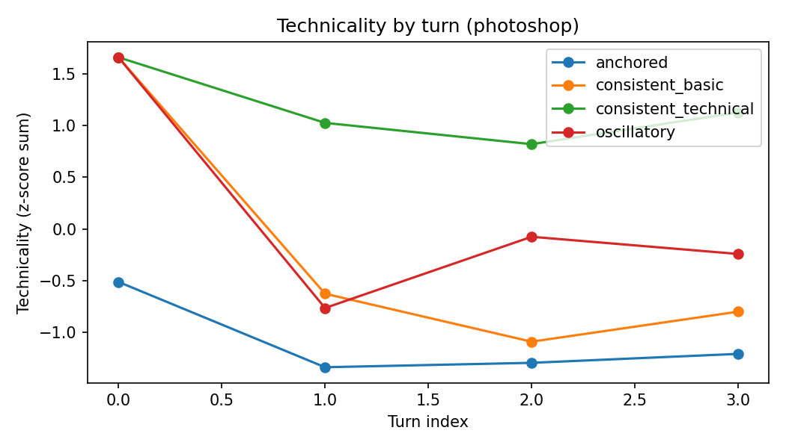
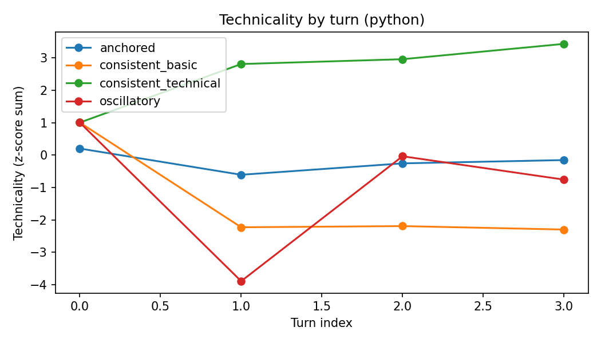
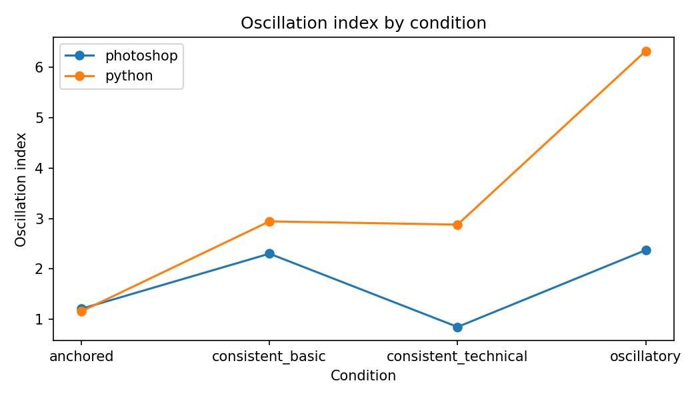

# First test report (run_20251223_230355)

Inputs
- Model: Qwen2.5-3B-Instruct
- Domains: Photoshop (color/lighting match), Python (traceback debug)
- Conditions: consistent_basic, consistent_technical, oscillatory, anchored
- Conversations: 10 per condition per domain
- Turns: 4 assistant turns (base + 3 feedbacks)

Key graphs

Summary: oscillation index (mean, std)

| domain | condition | mean | std | count |
| --- | --- | --- | --- | --- |
| photoshop | anchored | 1.2083600101892304 | 0.7433743683928664 | 10 |
| photoshop | consistent_basic | 2.3016471942614705 | 1.659179071755627 | 10 |
| photoshop | consistent_technical | 0.8483156959876508 | 0.6514163559003053 | 10 |
| photoshop | oscillatory | 2.3712185841731923 | 1.9808538035435503 | 10 |
| python | anchored | 1.1569916224526782 | 0.5367993362183674 | 10 |
| python | consistent_basic | 2.942348672452036 | 1.8803392206002032 | 10 |
| python | consistent_technical | 2.878557948782226 | 2.176805856753241 | 10 |
| python | oscillatory | 6.3218847350149385 | 2.7847712044332167 | 10 |

Summary: mean abs delta and flip rate

| domain | condition | mean_abs_delta | flip_rate |
| --- | --- | --- | --- |
| photoshop | anchored | 0.7359919865340349 | 0.55 |
| photoshop | consistent_basic | 1.4655553927704417 | 0.6 |
| photoshop | consistent_technical | 0.5890290372575782 | 0.4 |
| photoshop | oscillatory | 1.479066507900179 | 0.6 |
| python | anchored | 0.8315430264693215 | 0.4 |
| python | consistent_basic | 1.787544581467369 | 0.6 |
| python | consistent_technical | 1.6830100013411289 | 0.6 |
| python | oscillatory | 3.3556098399623266 | 0.8 |

Summary: technicality score (mean, std)

| domain | condition | mean | std | count |
| --- | --- | --- | --- | --- |
| photoshop | anchored | -1.0881100724982748 | 2.302528128493691 | 40 |
| photoshop | consistent_basic | -0.214165649551121 | 2.764593728782225 | 40 |
| photoshop | consistent_technical | 1.1579118279636513 | 1.9513377114271788 | 40 |
| photoshop | oscillatory | 0.14436389408574024 | 2.118609280889553 | 40 |
| python | anchored | -0.20351948906596934 | 1.5574515676223024 | 40 |
| python | consistent_basic | -1.4280155046478942 | 2.670614181637289 | 40 |
| python | consistent_technical | 2.551277276244794 | 2.2687204592506465 | 40 |
| python | oscillatory | -0.9197422825309276 | 3.186270821675853 | 40 |

Effect size: oscillatory minus anchored (Cohen d)

| domain | osc_minus_anchored | cohen_d |
| --- | --- | --- |
| photoshop | 1.1628585739839619 | 0.7772810369613914 |
| python | 5.16489311256226 | 2.575517403140966 |

Turn-level technicality by domain

| domain | condition | turn_index | technicality |
| --- | --- | --- | --- |
| photoshop | anchored | 0 | -0.5120471289883883 |
| photoshop | anchored | 1 | -1.337374460633282 |
| photoshop | anchored | 2 | -1.2947593020604473 |
| photoshop | anchored | 3 | -1.2082593983109813 |
| photoshop | consistent_basic | 0 | 1.659782202680144 |
| photoshop | consistent_basic | 1 | -0.6263454619509318 |
| photoshop | consistent_basic | 2 | -1.0901961969970064 |
| photoshop | consistent_basic | 3 | -0.7999031419366899 |
| photoshop | consistent_technical | 0 | 1.659782202680144 |
| photoshop | consistent_technical | 1 | 1.0257713487125248 |
| photoshop | consistent_technical | 2 | 0.8198161733154802 |
| photoshop | consistent_technical | 3 | 1.126277587146457 |
| photoshop | oscillatory | 0 | 1.659782202680144 |
| photoshop | oscillatory | 1 | -0.764573482380645 |
| photoshop | oscillatory | 2 | -0.07583904298259027 |
| photoshop | oscillatory | 3 | -0.2419141009739477 |
| python | anchored | 0 | 0.2021361268180729 |
| python | anchored | 1 | -0.6070903157316938 |
| python | anchored | 2 | -0.2554814062933269 |
| python | anchored | 3 | -0.15364236105692958 |
| python | consistent_basic | 0 | 1.0037384179791422 |
| python | consistent_basic | 1 | -2.2271730487731585 |
| python | consistent_basic | 2 | -2.1911446689827097 |
| python | consistent_basic | 3 | -2.2974827188148508 |
| python | consistent_technical | 0 | 1.0037384179791422 |
| python | consistent_technical | 1 | 2.81035628969114 |
| python | consistent_technical | 2 | 2.958859658866841 |
| python | consistent_technical | 3 | 3.432154738442051 |
| python | oscillatory | 0 | 1.0037384179791422 |
| python | oscillatory | 1 | -3.8905901322267864 |
| python | oscillatory | 2 | -0.03598937716970929 |
| python | oscillatory | 3 | -0.7561280387063574 |

Findings
- Oscillatory feedback yields the largest instability in both domains. The effect is much stronger in Python.
- Anchoring reduces oscillation index and flip rate relative to oscillatory.
- Consistent_technical shows higher mean technicality, while consistent_basic drives it lower.
- Python oscillatory responses show large swings, likely amplified by code-vs-prose mode shifts.

Caveats
- The oscillation index may conflate a single large step change with true oscillation.
- n=10 per condition is small; variance is high in some cells.
